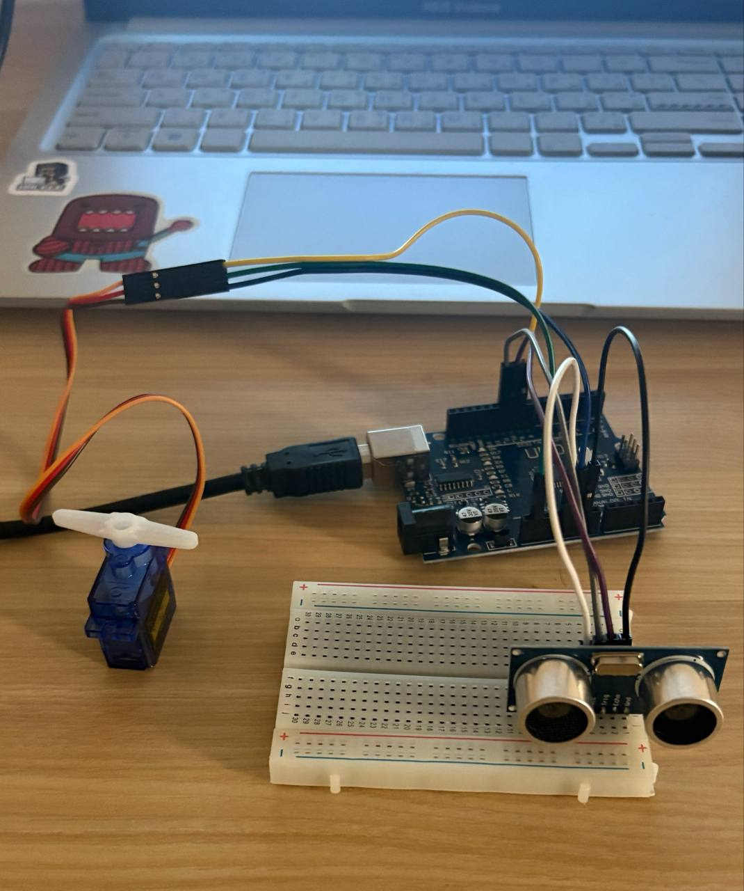
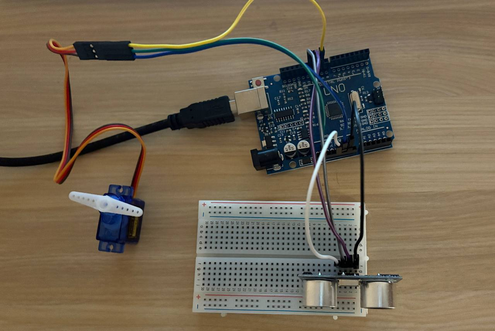

# Object Detection Servo Control using Arduino

## Description

This project uses an Arduino Uno, an HC-SR04 ultrasonic sensor, and an SG90 servo motor to detect nearby objects. When an object is detected within a predefined distance threshold, the servo motor rotates to a specified angle. When the object moves away, the servo returns to its initial position.

The project demonstrates the integration of distance sensing with actuator control, making it suitable for applications such as automatic doors, smart bins, and obstacle detection systems.

---

## Components

- Arduino Uno
- HC-SR04 Ultrasonic Sensor
- SG90 Servo Motor
- Breadboard
- Jumper Wires
- USB Cable

---

## Features

- Real-time distance measurement using the HC-SR04 sensor.
- Automatic servo motor movement based on object distance.
- Serial Monitor displays the measured distance.
- Adjustable distance threshold through the source code.

---

---

## Project Preview

### Hardware Setup

### Demo

---

## Circuit Connections

| Component | Arduino Pin |
|-----------|-------------|
| Servo Signal | D9 |
| Servo VCC | 5V |
| Servo GND | GND |
| HC-SR04 VCC | 5V |
| HC-SR04 GND | GND |
| HC-SR04 Trig | D11 |
| HC-SR04 Echo | D10 |

---

## How It Works

1. The ultrasonic sensor continuously measures the distance to nearby objects.
2. The measured distance is displayed in the Serial Monitor.
3. If an object is detected within 10 cm, the servo rotates to 90°.
4. When the object moves farther than 10 cm, the servo returns to 0°.

---

## Project Files

| File | Description |
|------|-------------|
| [Arduino_Servo_Distance.ino](Arduino_Servo_Distance.ino) | Arduino source code |
| [Circuit.jpg](Circuit.jpg) | Hardware connection |
| [Demo.mp4](Demo.mp4) | Demonstration video |
| [README.md](README.md) | Project documentation |

---

## Output

- Servo remains at **0°** when no object is nearby.
- Servo rotates to **90°** when an object is detected within **10 cm**.
- Distance readings are displayed continuously in the Serial Monitor.

---

## Technologies Used

- Arduino IDE
- C++
- HC-SR04 Ultrasonic Sensor
- SG90 Servo Motor
